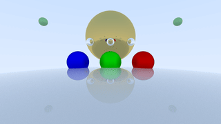

# ocaml-rt

A simple parallel raytracer written in a (conservative subset of) multicore OCaml.

Based significantly on https://raytracing.github.io/books/RayTracingInOneWeekend.html with some additions.

See `config.json5`.

